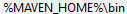

## Repo Details
| WebSite   | REPO                           |
|-----------|--------------------------------|
| GitHub    | https://github.com/nishakar123 |
| BitBucket | https://bitbucket.org/nishakar123 |

---
## Service Port
* api-gateway : 9091
* auth2-service : 9000
* auth-service : 9001
* config-server : 8888
* file-handling-service : 8081
* registry-service : 8761
* spring-boot-new-features : 8080
* vehicle-parking-service : 8082
* kafka-producer : 8083
* kafka-consumer : 8084
---
## How do I get set up?
* To Build the project
  * mvn clean
  * mvn clean install
  * To run **mvn clean install**, db setup is mandatory and service to be started so build will be successful.
* Install Git
  * https://git-scm.com/download/win
* Install Java
  * https://www.oracle.com/in/java/technologies/downloads/
  * https://jdk.java.net/
* Install Maven
  * https://maven.apache.org/download.cgi
* Install Postgres
  * https://www.postgresql.org/download/ (recommended)
  * https://www.enterprisedb.com/downloads/postgres-postgresql-downloads
---
## Installing Git
Run the downloaded executable file to install Git in system.  

---
## Installing Java
Simply run the executable file to install java and set the installed java path to environment variable.

---
## Installing Maven
Simply extract the downloaded zip file to any location and set the installed maven bin path to environment variable.
Better to set one new Key with MAVEN_HOME.  
New Key :   
Path Variable : 
---
## To see tree structure of project
* Install tree first on Windows
> winget install tree
* run below cmd from root project to see project tree structure
> tree /F
---
## Kill the process running on PORT on windows system
* Step1: Find the running process PID with port no.

      C:\Users\nisha>netstat -ano | findstr :8888
      TCP    0.0.0.0:8888           0.0.0.0:0              LISTENING       17200
      TCP    [::]:8888              [::]:0                 LISTENING       17200
* Step2: Kill the process with PID

      C:\Users\nisha>taskkill /PID 17200 /F
---
## Swagger Implementation
* Step1: Below Dependency needs to be added.

        <dependency>
            <groupId>org.springdoc</groupId>
            <artifactId>springdoc-openapi-starter-webmvc-ui</artifactId>
            <version>2.8.13</version>
        </dependency>
* Step2: Hit the URL: http://localhost:8086/swagger-ui/index.html#
---
## Installing and Configuring Postgres
* Step1 : Check postgres installed version
  * postgres --version
* Step2 : If postgres not installed then do the below steps
  * Download the postgres archive from https://www.postgresql.org/download/
  * Unzip it and keep it in any directory
  * Set the bin directory path in environment variable
    * 
  * Repeat Step1 to check postgres version
* Step3 : Go to installed postgres pgsql directory
  * C:\pgsql>
* Step4 : Initialize database(data) directory using below cmd
  * C:\pgsql>initdb -D data
* Step5 : Go to initialized data directory
  * C:\pgsql>cd data
* Step6 : Start the postgres service
  * C:\pgsql\data>pg_ctl -D . -l logfile start
* Step7 : To check and restart the postgres service
  * C:\pgsql\data>pg_ctl -D . status - To check the service running status
  * C:\pgsql\data>pg_ctl -D . -l logfile restart - To restart the service
  * C:\pgsql\data>pg_ctl -D . -l logfile stop - To stop the service
* Step8 : Create new user
  * C:\pgsql\data>createuser -d --role=nisha -P -r -s nishakar
    * nisha is home directory, same we need to enter in role while creating new user
      * To check username open cmd and see **C:\Users\nisha>**
    * nishakar is new user which we are creating
    * it will ask for a password, you can give your own password(root@123)
* Step9 : Create database(DB)
  * C:\pgsql\data>createdb -O nishakar nishakardb
    * nishakar is role name, same while creating the user we have given
    * nishakardb is the db name, we can give our own db name
* Step10 : Connect to newly created db
  * C:\pgsql\data>psql -d nishakardb -U nishakar
    * nishakardb is newly created db name
    * nishakar is newly created user
    * it will connect to db and open the sql run cmd where we can run sql query
      * nishakardb=#
    * nishakardb=# \du - list all user
    * nishakardb=# \l - list all database
    * nishakardb=# exit - will comeout from sql cmd
* Step11 : Some important sql cmd
  * drop role <role_name>;
  * drop database <database_name>

  * GRANT TEMP ON DATABASE nishakardb TO nishakar;
  * GRANT SELECT, INSERT, UPDATE, DELETE ON ALL TABLES IN SCHEMA public TO nishakar;
  * GRANT EXECUTE ON ALL FUNCTIONS IN SCHEMA public TO nishakar;
  * GRANT USAGE ON ALL SEQUENCES IN SCHEMA public TO nishakar;

  * ALTER ROLE <role_name> WITH PASSWORD '<new_password>';
  * ALTER ROLE <role_name> WITH PASSWORD '<new_password>' 'December 31, 2020';
  * ALTER USER <role_name> WITH PASSWORD '<new_password>';
  * ALTER USER <role_name> VALID UNTIL 'Jan 1, 2015';
  * ALTER USER <role_name> VALID UNTIL 'infinity';
---
## Kafka Installation Guide
### ⚠️ IMPORTANT (Kafka 4.x KRaft not Zookeeper)
## Error during Kafka Setup
### Error 1:
🚨 Kafka on Windows Rule
Kafka MUST NOT be installed in a directory that contains spaces
* Wrong: D:\Softwares\Program Files\kafka\bin\windows
* Correct: D:\Softwares\kafka\bin\windows
---
### Error 2:
```sh
The input line is too long.
The syntax of the command is incorrect.
```
✅ Fix #1 (Correct Way) — Use PowerShell Instead of CMD
Kafka 4.x on Windows must be run from PowerShell
▶️ Step 1 — Open PowerShell as Administrator
Right Click → Run as Administrator
then go to directory to run the required cmd
---
### Error 3:
```sh
main ERROR Reconfiguration failed: No configuration found for '764c12b6'
```
```sh
2026-02-19T12:23:53.750035900Z main ERROR Reconfiguration failed: No configuration found for '764c12b6' at 'null' in 'null'
Bootstrap metadata: BootstrapMetadata(records=[ApiMessageAndVersion(FeatureLevelRecord(name='metadata.version', featureLevel=29) at version 0), ApiMessageAndVersion(FeatureLevelRecord(name='eligible.leader.replicas.version', featureLevel=1) at version 0), ApiMessageAndVersion(FeatureLevelRecord(name='group.version', featureLevel=1) at version 0), ApiMessageAndVersion(FeatureLevelRecord(name='share.version', featureLevel=1) at version 0), ApiMessageAndVersion(FeatureLevelRecord(name='streams.version', featureLevel=1) at version 0), ApiMessageAndVersion(FeatureLevelRecord(name='transaction.version', featureLevel=2) at version 0)], metadataVersionLevel=29, source=format command)
Formatting metadata directory D:/Softwares/kafka/kraft-combined-logs with metadata.version 4.2-IV1
```
* ✅ This is actually SUCCESS — not an error
  People get confused because of this log line 👇
  main ERROR Reconfiguration failed: No configuration found for '764c12b6'
  This is coming from Log4j dynamic reconfiguration
  👉 NOT from Kafka storage formatting

✅ Important Line in Your Output
>Formatting metadata directory D:/Softwares/kafka/kraft-combined-logs
with metadata.version 4.2-IV1

💥 This means:
* Cluster UUID applied
* Metadata log created
* KRaft storage formatted successfully
* Controller quorum config accepted
* You are READY to start Kafka
---
### Error 4:
>Because controller.quorum.voters is not set on this controller, you must specify one of the following: --standalone, --initial-controllers, or --no-initial-controllers.

>Required for KRaft mode
```sh
process.roles=broker,controller
node.id=1
controller.listener.names=CONTROLLER
listeners=PLAINTEXT://localhost:9092,CONTROLLER://localhost:9093
listener.security.protocol.map=CONTROLLER:PLAINTEXT,PLAINTEXT:PLAINTEXT
controller.quorum.voters=1@localhost:9093
inter.broker.listener.name=PLAINTEXT
```
---
### Error 5:
> 2026-02-19T12:58:32.752888300Z main ERROR Reconfiguration failed: No configuration found for '764c12b6' at 'null' in 'null'

👉 This is NOT a Kafka error
This is coming from:
Log4j2 Dynamic Logger Reconfiguration

Kafka 4.x internally tries to reload logging config dynamically and prints this when no runtime config exists.

It does NOT affect:
* Broker startup
* Topic creation
* Producer send
* Consumer poll
* Controller quorum
* Metadata log
* Network communication
* So you can safely ignore it ✅
---
## Steps to install Kafka in Windows
Download the Kafka from here: [https://kafka.apache.org/community/downloads/]
##### Step1: Extract the downloaded file in directory(D:\Softwares\kafka).
##### Step2: Change the **log.dirs** directory in below properties file
    D:\kafka\config\
    * broker.properties (log.dirs=D:/Softwares/kafka/kraft-broker-logs)
    * controller.properties(log.dirs=D:/Softwares/kafka/kraft-controller-logs)
    * server.properties(log.dirs=D:/Softwares/kafka/kraft-combined-logs)
##### Step3: Generate a Cluster UUID
>      D:\kafka\bin\windows> .\kafka-storage.bat random-uuid
RTe9vR2iT8-OgmilRLAy_A - Generated UUID
##### Step4: Format Log Directories
```sh
      D:\Softwares\kafka\bin\windows> .\kafka-storage.bat format -t RTe9vR2iT8-OgmilRLAy_A -c ..\..\config\server.properties
```
##### Step5: Start the Kafka Server
>       D:\Softwares\kafka\bin\windows> .\kafka-server-start.bat ..\..\config\server.properties
##### Step6: Open new terminal to Create a topic to store your events
>      D:\Softwares\kafka\bin\windows>kafka-topics.bat --create --topic quickstart-events --bootstrap-server localhost:9092
>      Created topic quickstart-events.
##### Step7: Describe created topic to see details
>      D:\Softwares\kafka\bin\windows>kafka-topics.bat --describe --topic quickstart-events --bootstrap-server localhost:9092

>Topic: quickstart-events        TopicId: 1zN1XrUEQiyFUuXgD7KEFw PartitionCount: 1       ReplicationFactor: 1  Configs: min.insync.replicas=1,segment.bytes=1073741824
Topic: quickstart-events        Partition: 0    Leader: 1       Replicas: 1     Isr: 1  Elr: LastKnownElr:
##### Step8: Write some events into the topic
>       D:\Softwares\kafka\bin\windows>.\kafka-console-producer.bat --topic quickstart-events --bootstrap-server localhost:9092
>hi
>hello
##### Step9: Open new terminal to Read the events
>       D:\Softwares\kafka\bin\windows>.\kafka-console-consumer.bat --topic quickstart-events --from-beginning --bootstrap-server localhost:9092
>hi
>hello
##### Step10: List all topics
>       D:\Softwares\kafka\bin\windows>.\kafka-topics.bat --bootstrap-server localhost:9092 --list
     __consumer_offsets
     quickstart-events
     test-topic
##### Step11: Terminate the Kafka environment
* Now that you reached the end of the quickstart, feel free to tear down the Kafka environment—or continue playing around.
    * Stop the producer and consumer clients with Ctrl-C, if you haven't done so already.
    * Stop the Kafka broker with Ctrl-C.
---


